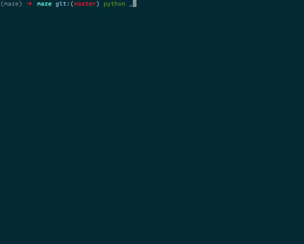

# Maze Generator and Solver

<p align="center">
  
</p>

This repository is part of the [reciTAL](https://recital.ai/) technical
interview process.

The project is divided into two parts:
- Maze Generator: responsible to generate a Maze with some [properties](maze.py)
  predefined. It uses a [DFS](https://en.wikipedia.org/wiki/Depth-first_search)
  to do the job, but instead of taking the neighbor cells in a sorted way, it
  takes neighbor cells randomly.
- Maze Solver: responsible to solve the Maze. It uses a
  [backtracking](https://en.wikipedia.org/wiki/Backtracking) strategy, as the
  generator. But here we use a
  [BFS](https://en.wikipedia.org/wiki/Breadth-first_search), as we need the
  shortest path between the Maze entrance and exit, which is not granted with a
  DFS.

## Installation

The environment management system used was
[conda](https://docs.conda.io/en/latest/). For those who prefer
[pipenv](https://github.com/pypa/pipenv) or other managers, there's a
[requirement file](requirements.txt) available.

We just need to clone the repository and create the environment.
```
git clone https://github.com/Kludex/maze
cd maze/

conda env create -f environment.yml
conda activate maze
```

If you want to make sure that everything is fine:
```
conda env list
```

## Usage

If you just want to without choosing any entrance, please run the command:
```
python .
```

Otherwise, if you want to choose the coordinates:
```
python . [x] [y]
```

## Collaborators

- Code: [Marcelo Trylesinski](https://github.com/Kludex)
- Challenge: [Sébastien Lefort](https://github.com/seblef)